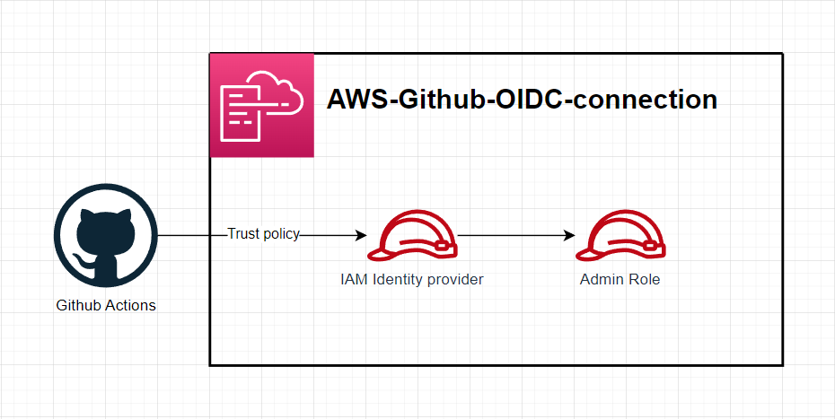
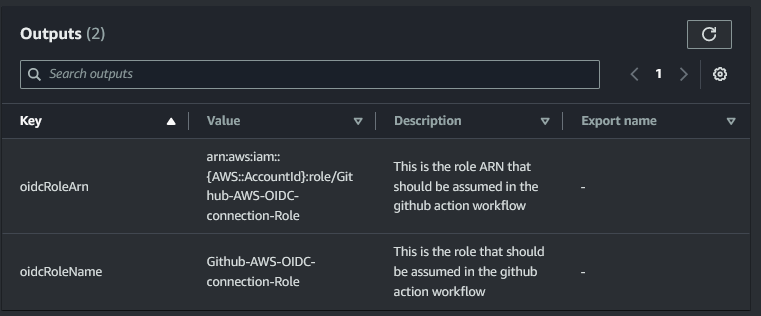

# AWS-Github-oidc-idp-connection



This stack deploys an AWS IAM Identtiy Provider for `Github Actions`. The role output by this stack can be assumed in your workflow to deploy to AWS.


You can set the role ARN as a Github Secret then assume it in the workflow file.

```yaml
- uses: configure-aws-credentials@v4
  with:
    role-to-assume: arn:aws:iam::{AWS::AccountId}:role/Github-AWS-OIDC-connection-Role
    aws-region: $STACK_REGION
```
